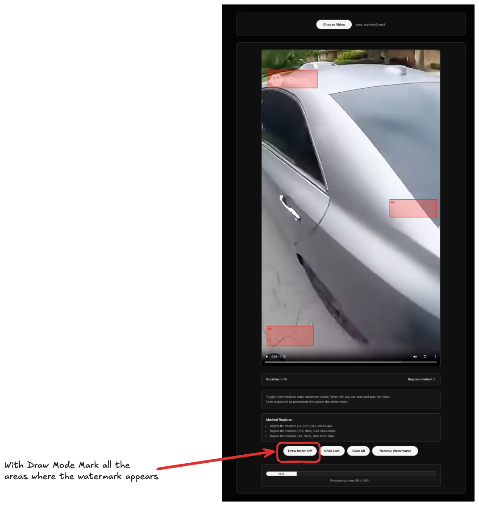

# AI Watermark Remover


<div style="text-align: center;">
  
</div>
<br>
A web application for removing watermarks from videos using AI-powered inpainting with LaMa (Large Mask Inpainting).

## Results

| Original                                                                                                                                                                                                 | Output                                                                                                                                                                                                                                                                                                                                                                                                                                                                                                                                                                                                                                                                                              |
|-----------------------------------------------------------------------------------------------------------------------------------------------------------------------------------------------------------|------------------------------------------------------------------------------------------------------------------------------------------------------------------------------------------------------------------------------------------------------------------------------------------------------------------------------------------------------------------------------------------------------------------------------------------------------------------------------------------------------------------------------------------------------------------------------------------------------------------------------------------------------------------------------------------------------------------|
| [](assets/sora_example.mp4?raw=true) | [](assets/watermark_removed_video.mp4?raw=true) |


## Features

- Upload video files (MP4, AVI, MOV, MKV)
- Interactive video player with frame-by-frame navigation
- Manual watermark region marking with drawing tool
- AI-powered inpainting using LaMa model
- Download processed videos

## Prerequisites

- Python 3.8+
- ffmpeg (with VideoToolbox support for Apple Silicon)

## Installation

### Setup on MacOS

```bash
chmod +x setup_macos.sh
./setup_macos.sh
```

## Usage

### Start Backend

```bash
chmod +x start_backend.sh
./start_backend.sh
```

Backend runs on `http://localhost:8000`

### Start Frontend

Open index.html 

### Usage


<div style="text-align: center;">
  
</div>
<br>

